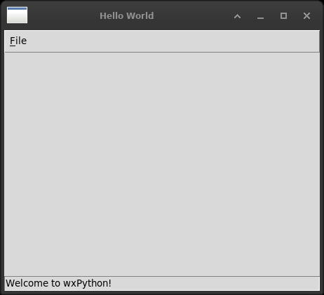

# 1. Welcome to Tkinter

The book opens with the smallest program that puts a window on the screen,
and the difference between the two toolkits is there in the first eight
lines.



*A menu, a status bar and an about box. Two of the three are things
Tkinter has: there is no status bar widget, and a sunken Label is
what everybody makes one out of.*


wxPython separates the **application** from the **window**. A `wx.App` is
subclassed, `OnInit()` builds a `wx.Frame`, the frame is shown, the frame is
named the top window, and `OnInit()` returns `True` to say that starting
worked. Then `MainLoop()`.

```python
class App(wx.App):
    def OnInit(self):
        frame = wx.Frame(parent=None, title='Bare')
        frame.Show()
        return True

app = App()
app.MainLoop()
```

Tkinter does not make the distinction. `tk.Tk()` is the application and the
first window at once; it is on the screen from the moment it exists, so
there is nothing to show; there is no place to report that starting worked,
because there is no separate starting.

```python
root = tk.Tk()
root.title("Bare")
root.mainloop()
```

Which of the two is the better arrangement is not a question this book
answers. What can be said is what each costs to write and what each lets you
say later. wx gives a place to put everything that happens before the first
window: a splash screen, a licence check, reading a configuration, deciding
which window to open. Tkinter has no such place and that work goes wherever
the author puts it. Against that, three lines and two concepts.

## The files

| file | section |
|---|---|
| `bare.py` | 1.2 the bare minimum |
| `spare.py` | 1.3 a starting point to build on |
| `hello.py` | 1.4 a window the size of a photograph |
| `sample.py` | 1.5 an event: the mouse position |
| `python_compare.py` | 1.6 menu, status bar, about box |

### bare.py

Three lines, and no class. The original subclasses `wx.App` because wx
requires an application object; Tkinter requires nothing, so nothing is
subclassed. The class arrives in the next file, when there is something to
put in it.

### spare.py

*A starting point for simple programs*, says the original docstring, and that
is what it is: the same window with a class of its own, a name, and a main
guard. From here on every example in the book looks like this one.

The wx version calls `SetTopWindow()`. There is no translation: with one
window there is nothing to nominate, and `mainloop()` ends when the window
does.

### hello.py

A window sized to a photograph. The first thing in the book Tkinter cannot
do by itself, and the first trap that has no counterpart in wx.

**No JPEG.** `wx.Image('wxPython.jpg', wx.BITMAP_TYPE_JPEG)` reads the file
and that is the end of it. `tk.PhotoImage` reads GIF, PGM, PPM and, since Tk
8.6, PNG. Not JPEG. The file has to be decoded by something else and handed
over, and that something is Pillow:

```python
from PIL import Image, ImageTk
self.photo = ImageTk.PhotoImage(Image.open(path))
```

Which is a dependency, on the first picture in the book. It is also, as it
happens, Fredrik Lundh's library, by the same hand as the Tkinter dialogs.

**The image must be kept alive.** This is the one to remember:

```python
self.photo = ImageTk.PhotoImage(image)      # right
photo = ImageTk.PhotoImage(image)           # blank window
```

A Tkinter widget does not own the image it displays. It holds the name of a
Tk image object, and the Python `PhotoImage` is what keeps that object
alive. If the only reference is a local variable, it is collected the moment
the function returns, Tk destroys the image with it, and the Label draws
nothing - with no error, no warning and nothing in the traceback, because
nothing went wrong as far as Python is concerned. The window is simply
empty.

In wx the bitmap is handed to the widget and the widget owns it. Nothing has
to be remembered.

**One repair to the original's habit.** The wx version opens `'wxPython.jpg'`
by a bare name, which means the program only runs from the directory the file
is in. Here the path is built from `__file__`, so the example runs from
anywhere - which it has to, because every file in this project is meant to be
run on its own.

Measured: the window comes out 524x125, the size of the image, once the
Label is asked for `borderwidth=0` and `highlightthickness=0`. Without them
a Label adds a border and a focus ring, one pixel each per side.

### sample.py

The first example with an event. The pointer moves over a panel and the
position is written into a field.

| wx | Tkinter |
|---|---|
| `panel.Bind(wx.EVT_MOTION, self.OnMove)` | `frm_panel.bind("<Motion>", self.on_move)` |
| `event.GetPosition()` returns a `wx.Point` | `event.x` and `event.y`, plain integers |

Both give the position **relative to the widget that was bound**, not to the
screen. `winfo_pointerxy()` also exists and gives screen coordinates, which
is a different question and the wrong answer here.

The event constants differ in kind rather than in spirit: wx names them,
`wx.EVT_MOTION`, and Tk describes them in a string, `"<Motion>"`. A name that
does not exist is an `AttributeError` when the program starts; a string that
is wrong is a `TclError` when the line runs.

### python_compare.py

A menu, a status bar and an about box: the furniture a finished window is
expected to have.

| wx | Tkinter |
|---|---|
| `wx.MenuBar` and `wx.Menu` | `tk.Menu` for both; the bar is a menu whose items cascade |
| `menuFile.Append(1, "&About...")` | `add_command(label="About...", underline=0)` |
| `self.Bind(wx.EVT_MENU, self.OnAbout, id=1)` | `command=self.on_about`, given when the item is made |
| `wx.MessageBox(...)` | `messagebox.showinfo(...)` |
| `self.CreateStatusBar()` | nothing - see below |
| `self.Close()` | `self.destroy()` |

Three things are worth stopping on.

**Menu items carry their command.** wx gives each item a number, binds the
number to a handler, and the handler receives an event it usually ignores.
Tkinter is given the function when the item is created and calls it with no
arguments. There are no identifiers to keep unique and no event object that
is not used.

**There is no status bar.** `wx.Frame.CreateStatusBar()` makes one, with
fields, and `SetStatusText()` writes to it. Tkinter has no such widget. What
everybody does instead is a `Label` with `relief=SUNKEN`, `anchor=W` and
`fill=X`, packed at the bottom - which is what a status bar is, and which has
to be assembled every time.

**Closing is a message, not an event.** `self.Close()` in wx sends a close
event that something may veto, which is how *save before quitting?* is asked.
Tkinter has no close event: the window manager sends a protocol message, and
`protocol("WM_DELETE_WINDOW", handler)` is where it is caught. The handler
takes no arguments and decides for itself whether to call `destroy()`.
