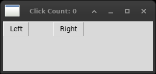

# 3. Working in an event-driven environment

wx and Tk agree on what an event is and disagree on almost everything about
how it is said.



*Both buttons pressed, and the window told - by a virtual event that
rises to it through the bindtags. The count is in the title because
the event itself cannot carry it.*


| wx | Tkinter |
|---|---|
| `self.Bind(wx.EVT_BUTTON, handler, button)` | `tk.Button(..., command=handler)` |
| `widget.Bind(wx.EVT_LEFT_DOWN, handler)` | `widget.bind("<Button-1>", handler)` |
| `wx.EVT_ENTER_WINDOW`, `wx.EVT_LEAVE_WINDOW` | `"<Enter>"`, `"<Leave>"` |
| `wx.EVT_MENU` bound to an item | `add_command(command=handler)` |
| `event.Skip()` | return nothing |
| not calling `event.Skip()` | `return "break"` |
| `wx.NewEventType()` + `wx.PyEventBinder` | `"<<AName>>"`, a virtual event |
| `GetEventHandler().ProcessEvent(evt)` | `widget.event_generate("<<AName>>")` |

Two differences of kind, rather than of spelling.

**An event name is a constant in wx and a string in Tk.** `wx.EVT_BUTTON`
that does not exist is an `AttributeError` when the module is imported;
`"<Buton-1>"` is a `TclError` when the line runs, which may be a while
later. Tk will not tell you that nobody is ever going to raise the event you
bound.

**A command is not an event.** `command=` is given a function that takes no
arguments and is told nothing about what happened. `bind()` is given a
function that takes an event and can ask it where the pointer was and what
keys were held. The wx way - one `Bind` for both - keeps them together; the
Tk way keeps them apart, and a handler that needs to know where the click
landed must be bound rather than commanded.

## Two handlers, one click

`double_event_one.py` puts both on the same button: a `command`, and a
binding on `<Button-1>`. Both run.

In wx, whether the second one runs is decided by the first:

```python
def OnMouseDown(self, event):
    self.button.SetLabel("Again!")
    event.Skip()          # and now let the button have it
```

Leave out `Skip()` and the button never sees the press - no pressed look, no
command, nothing. It is an opt-in to carrying on.

Tkinter is the other way round: handlers carry on by themselves, and a
handler stops the matter by returning the string `"break"`. Measured, on a
button with a command and a `<Button-1>` binding that returns `"break"`: the
binding runs, the command does not.

Neither arrangement is safer. wx makes you remember to pass it on, Tk makes
you remember to stop it.

## An event of one's own

`customEvent.py` is where the chapter gets interesting. wx builds a new kind
of event:

```python
class TwoButtonEvent(wx.PyCommandEvent):
    def SetClickCount(self, count):
        self.clickCount = count

myEVT_TWO_BUTTON = wx.NewEventType()
EVT_TWO_BUTTON = wx.PyEventBinder(myEVT_TWO_BUTTON, 1)
```

A type, a binder, a class with data in it, and `ProcessEvent()` to send it.
The panel that raises it does not know who is listening, and the frame that
listens does not know how the panel decided - which is the point of having
events at all.

Tk has the same idea and calls it a **virtual event**. A name in double
angle brackets, generated on a widget and bound anywhere along its
bindtags:

```python
self.event_generate("<<TwoButton>>")        # on the panel
self.bind("<<TwoButton>>", self.on_two_click)   # on the window
```

No type to register, no binder to make, nothing to declare. It rises to the
window because the toplevel is one of the panel's bindtags:

    ('.!frame', 'Frame', '.', 'all')

which is Tk's answer to wx's event propagation, and is visible rather than
implied.

### What does not translate: the event carries nothing

The wx event has a `clickCount` in it. A Tk virtual event has nowhere to put
one.

Tcl has had a `-data` field on virtual events since 8.5, and
`event_generate("<<TwoButton>>", data="42")` is accepted. It does not
arrive. The reason is in the Python on this machine:

```python
_subst_format = ('%#', '%b', '%f', '%h', '%k',
                 '%s', '%t', '%w', '%x', '%y',
                 '%A', '%E', '%K', '%N', '%W', '%T', '%X', '%Y', '%D')
```

That is the list of fields Tkinter asks Tcl for when an event arrives. `%d`,
which is the data, is not in it, so `event.data` does not exist and cannot.

What an event does carry is `event.widget`, the thing it happened to. So the
count travels on the panel and the handler reads it from there:

```python
def on_two_click(self, event):
    self.title("Click Count: {}".format(event.widget.click_count))
```

Which works, and is worth being honest about: the sender and the receiver
are no longer strangers. The receiver now knows that whatever raised this
event has an attribute called `click_count`. wx's event object is a
genuinely looser coupling, and this is the one place in the chapter where
the wx design gives something Tkinter does not.

### A trap worth the paragraph

`event_generate` on a widget that has not been mapped yet does nothing. No
error, no warning, no event - it is simply dropped. A panel packed and then
immediately told to raise something is too early, and the window has to have
been through an `update()` first.

This cost an hour while writing the chapter, and it is the sort of thing
that looks like *my virtual events do not work* rather than *my window is
not on the screen yet*.

## The files

| file | what it is for |
|---|---|
| `menu_event.py` | a menu item with a command |
| `mouse_event.py` | `<Enter>` and `<Leave>` |
| `double_event_one.py` | two handlers for one click, and `"break"` |
| `customEvent.py` | a virtual event, and what it cannot carry |

`customEvent.py` keeps the name the book gives it, camel case and all, for
the same reason every other file does: the mapping to the original is worth
more than the spelling.
