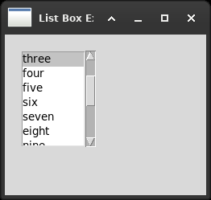

# 7. Working with the basic controls

Fifteen small files, one widget each. Most of them are a straight swap, and
the table is the chapter:



*A list box. wx.ListBox and tk.Listbox, and the only difference is
that Tk's does not scroll by itself: a Listbox with no Scrollbar
beside it shows what fits and says nothing about the rest.*


| wx | Tkinter |
|---|---|
| `wx.StaticText` | `tk.Label` |
| `wx.Button` | `tk.Button` |
| `wx.BitmapButton` | `tk.Button(image=...)` |
| `wx.CheckBox` | `tk.Checkbutton` + a `BooleanVar` |
| `wx.RadioButton` with `RB_GROUP` | `tk.Radiobutton`, grouped by its variable |
| `wx.RadioBox` | — a `LabelFrame` and a grid of radio buttons |
| `wx.Choice` | `ttk.Combobox(state="readonly")` |
| `wx.ComboBox` with `CB_DROPDOWN` | `ttk.Combobox` |
| `wx.ComboBox` with `CB_SIMPLE` | — an `Entry` and a `Listbox` |
| `wx.ListBox` | `tk.Listbox` |
| `wx.Gauge` | `ttk.Progressbar` |
| `wx.Slider` | `tk.Scale`, **not** `ttk.Scale` |
| `wx.SpinCtrl` | `ttk.Spinbox` |
| `wx.TextCtrl` | `tk.Entry` |
| `wx.TextCtrl` with `TE_MULTILINE` | `tk.Text` |
| `wx.TextCtrl` with `TE_PASSWORD` | `tk.Entry(show="*")` |
| `wx.TextCtrl` with `TE_RICH2` | `tk.Text` and tags, which is more |
| `wx.lib.buttons` | — nothing, and nothing is needed |

What is worth reading is the handful of entries with an em dash in them,
and one that has no dash and should.

## The state has to be held somewhere

A `wx.CheckBox` knows whether it is ticked and is asked with `GetValue()`.
A `tk.Checkbutton` keeps its state in a variable, and if none is given it
makes one of its own that nothing can find again.

```python
self.values[label] = tk.BooleanVar()
chk_box = tk.Checkbutton(self, text=label, variable=self.values[label])
```

The variable must outlive the constructor, exactly as an image must. A
`BooleanVar` held in a local is collected when the function returns and the
checkbox stops remembering anything. It is the same trap as chapter 1's
`PhotoImage`, in a different coat, and it is worth recognising the shape:
**in Tkinter, a widget does not own the Python object it was given.**

The same variable is what groups radio buttons. wx groups them by putting
`RB_GROUP` on the first and relying on the order they were created in; Tk
groups them by what they share, so nothing depends on the order and two
groups can be interleaved on the screen without confusing each other.

## Two widgets that are not there

**`wx.RadioBox`** is one widget that is a frame, a label and a set of radio
buttons arranged in so many rows or columns. Tkinter has all three parts and
no compound, so `radio_box.py` assembles it: a `ttk.LabelFrame` and a grid.
Twenty lines, once.

**`wx.CB_SIMPLE`**, a combo box whose list is always open, has no
equivalent. `ttk.Combobox` drops down and cannot be persuaded otherwise. It
is an `Entry` and a `Listbox` with the selection copied across, which is
what the widget is anyway.

## Where tk beats ttk

`slider.py` is the one file in the book that must not use ttk.

`wx.Slider` is asked for `SL_AUTOTICKS` and `SL_LABELS`: tick marks along
the groove and the number printed beside the handle. `tk.Scale` has
`tickinterval` and `showvalue` and does both. **`ttk.Scale` has neither**
and cannot be given them, because a themed widget's appearance belongs to
the theme.

The conventions of this project say to prefer ttk where a themed widget
exists. This is where the rule has an exception, and the exception is worth
knowing in general: the ttk widget is the better-looking one and sometimes
the less capable one, and a slider that has to show a scale is one of those
times.

## Where Tkinter has the better of it

`text_ctrl_multiple.py` shows styled text. The wx original says, in the
example text itself:

> If supported by the native control, this is reversed...

`TE_RICH2` is a request. It works on Windows, and elsewhere it does what
the platform's text widget can manage. Styles are applied by counting
characters from the start and handing over a `wx.TextAttr`.

A `tk.Text` has **tags**, on every platform, always. A tag is a name given
to one or more ranges, and it can carry a colour, a font, spacing, a
margin, a border - and it can also be bound to an event, moved, searched
for, and asked which ranges it covers.

```python
self.txt_rich.tag_configure("reversed", foreground="white",
                            background="black")
self.txt_rich.tag_add("reversed", "1.0 + 44 chars", "1.0 + 52 chars")
```

Tk is the older toolkit here and the richer one. Its text widget came out
of a research group that cared about text, and it shows.

## wx.lib.buttons, and why it does not translate

`generic_button.py` is the longest file in the chapter in wx and the least
interesting in Tkinter, and the reason is worth the paragraph.

A `wx.Button` is the platform's button. On this machine it is drawn by GTK,
it looks like every other button on the desktop, and it cannot be told to
be navy with white letters in a twenty-point font, because GTK does not
offer that. So wxPython ships `wx.lib.buttons`: a family of buttons drawn
in Python, which look the same everywhere and can be styled -
`GenButton`, `GenBitmapButton`, `GenToggleButton`, `GenBitmapTextButton`,
and the `SetBezelWidth` and `SetUseFocusIndicator` that go with them.

A `tk.Button` is drawn by Tk on every platform. Colour, font, border width,
an image, an image and a word together, staying down when pressed: every
one of them is an option on the one widget.

```python
tk.Button(self, text="bigger", font=("Helvetica", 20, "bold"),
          background="navy", foreground="white", borderwidth=5)

tk.Button(self, image=bitmap, text="Bitmapped Text", compound=tk.LEFT)

tk.Checkbutton(self, text="Toggle", indicatoron=False, variable=pressed)
```

That last one is the whole of `GenToggleButton`: a check button drawn as a
button rather than as a box.

The trade is the one that runs through this whole comparison. wx gives you
the platform's widget and a home-made one beside it when the platform's
will not do; Tk gives you one widget that is home-made everywhere. A Tk
program looks slightly foreign on every desktop and looks the same on all
of them, and there is no second family of buttons to learn.

## Two smaller notes

**`SetDefault()` is half a thing in Tk.** `default=tk.ACTIVE` draws a
button as the default one and does not make Return press it. That binding
is asked for separately, and `button.py` does.

**`EVT_IDLE` is not a Tkinter event.** `gauge.py` in wx moves its bar on
every idle, which is as fast as the machine allows - on a quick one the bar
is a blur. Tkinter says how fast in so many words, with `after()`. There is
an `after_idle()`, and it is for work that must happen before the screen is
next drawn, not for animation.

And a repeating `after()` **outlives the window that asked for it**. When
the window goes, the next callback fires at a widget that is not there, and
Tk says `invalid command name` from inside its own event loop with no
traceback worth reading. It showed up here the first time these examples
were put under a test that destroys its windows. Every repeating `after()`
needs an `after_cancel` somewhere, and in `gauge.py` that somewhere is
`destroy()`.

## The files

All fifteen translated. `bitmap_button.py` and `generic_button.py` want
`bitmap.bmp`, which belongs to the book and is not copied here; Tk does not
read BMP either, so the picture is drawn with `PhotoImage.put()` as in
chapter 6.
