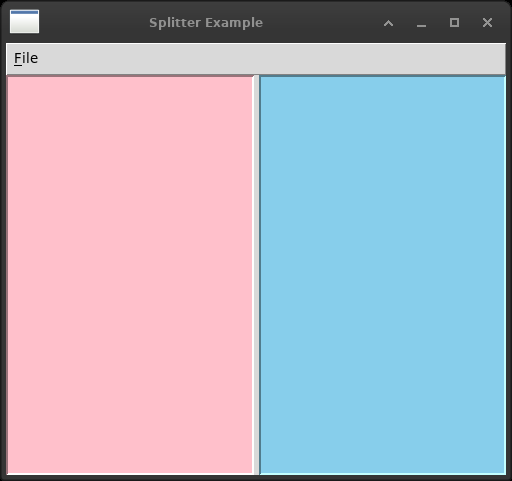

# 8. Putting widgets in frames

The chapter about windows themselves, and the one with the most dashes in
its table.



*Two panes with a bar between them. A ttk.PanedWindow is given its
orientation when it is made and cannot be turned afterwards, so the
menu that splits the other way builds a new one.*


| wx | Tkinter |
|---|---|
| `wx.Frame` | `tk.Tk` for the first, `tk.Toplevel` for the rest |
| `wx.MiniFrame` | `Toplevel` + `transient()`, without the thin title bar |
| `wx.SplitterWindow` | `ttk.PanedWindow` |
| `wx.ScrolledWindow` | — a `Canvas`, a `Frame` and two `Scrollbar`s |
| `wx.MDIParentFrame` | — nothing; a `ttk.Notebook` instead |
| `FRAME_EX_CONTEXTHELP` | — nothing, on any platform |
| `FRAME_SHAPED` + `SetShape` | — nothing; `overrideredirect` is the half that works |

## The one that is genuinely missing: MDI

`wx.MDIParentFrame` holds `wx.MDIChildFrame`s. They are real windows -
title bar, minimise box, the lot - that live inside another window and can
be tiled, cascaded and minimised there without leaving it.

Tkinter has nothing of the sort, and no way to build one. A `Toplevel` is
a window of the desktop; there is no way to put one inside another. The
nearest thing would be drawing fake title bars on a canvas and moving
frames about by hand, which is a project rather than a translation.

`mdi.py` here uses a `ttk.Notebook` instead, and it is worth saying that
this is not a consolation prize. MDI was how the nineteen-nineties held
several documents in one window, and tabs are how everything has held them
since - editors, browsers, the terminal this was written in. For nearly
every use of MDI, tabs are what people now expect.

The one thing tabs cannot do is show two documents **at once**, side by
side, inside the one window. That was MDI's real advantage and it is gone.
In Tkinter the answer is a `ttk.PanedWindow`, or two top-level windows,
which is what most programs do now anyway.

## The one that is missing and should not be: a scrolled window

`wx.ScrolledWindow` is a widget. Give it a virtual size, put things in it,
and it scrolls.

Tkinter has `Scrollbar`, and a handful of widgets that know how to talk to
one - `Listbox`, `Text`, `Canvas`, `Treeview`, `Entry`. **A `Frame` is not
one of them.** There is no way to scroll a frame full of widgets, which is
the commonest thing anybody wants to scroll.

The documented answer, and everybody's answer, is this:

```python
canvas = tk.Canvas(parent, scrollregion=(0, 0, width, height))
inner = tk.Frame(canvas)
canvas.create_window(0, 0, window=inner, anchor=tk.NW)
```

A `Canvas` can scroll, so the frame is put *inside* a canvas as a canvas
item. Three widgets and a scroll region to do what wx does with one class.
`scroll_window.py` wraps it up as a `ScrolledWindow` so that the rest of a
program can forget about it, which is what one ends up doing.

Two smaller differences hide inside it. `wx.Scroll()` takes pixels;
`xview_moveto` takes a fraction of the total width, so the arithmetic is
yours. And the scroll region does not follow the frame: if what is inside
grows, the region has to be told, usually from a `<Configure>` binding.

This is the least pleasant corner of Tkinter in this book. It is not hard,
it is not subtle, and it is the same fifteen lines written again in every
program that has a long form in it.

## Shaped windows

The wx original builds a region from a bitmap's transparency and gives it
to `SetShape`, and the window really is the shape of the drawing.

Tk cannot. Asked on this machine, a Tk window offers exactly these:

    -alpha  -topmost  -zoomed  -fullscreen  -type

`-alpha` is the transparency of the whole window at once, which is a
different thing; `-transparentcolor` exists on Windows and Tk answers *bad
attribute* here; and the X11 shape extension is not exposed at all.

What does work is `overrideredirect(True)`: a window with no title bar, no
border and usually no taskbar entry. So `shaped_frame.py` shows the picture
in a bare window with square corners, and says so.

`shaped_frame_mobile.py` then has to solve the problem that follows.
**A window with no title bar cannot be moved**, because moving a window is
what a title bar is for. Seven lines: remember where in the window the
pointer went down, and on every drag put the window at the pointer less
that offset.

```python
x = self.winfo_pointerx() - self.offset[0]
self.geometry("+{}+{}".format(x, y))
```

`event.x` is relative to the widget and `winfo_pointerx()` is relative to
the screen, and one needs both: without the offset the window jumps so that
its corner is under the pointer. The same seven lines appear in every
splash screen, every drag handle and every floating palette.

## Context help

`wx.FRAME_EX_CONTEXTHELP` puts a question mark in the title bar. It is a
Windows arrangement and wx says so - on GTK the flag does nothing.

Tk cannot ask for it anywhere. What is on a title bar is the window
manager's business, and the only parts Tk can touch are whether the window
resizes and whether it has decorations at all.

So `help_context.py` shows what one does instead, which is a tooltip - and
the standard library has no tooltip either. It is a `Toplevel` with
`overrideredirect(True)` placed near the pointer after a delay, taken away
on `<Leave>`, with the delay cancelled if the pointer leaves first.

Fifty lines, and worth having: for a laboratory form, a tooltip on the lot
number field saying *six digits, no letters* is the difference between a
form that is filled in correctly and one that is filled in twice.

## Mini frames

`wx.MiniFrame` is a small window with a thin title bar that floats over its
parent and stays out of the taskbar - a tool palette.

`transient(parent)` is most of it: the window stays above its parent, is
iconified with it, and the window manager usually keeps it off the taskbar.
The thin title bar is the part that does not come across, because the title
bar is drawn by the window manager and Tk has no way to ask for a smaller
one.

## Splitters

`wx.SplitterWindow` holds two windows and can be told to split either way,
or not at all, on the same object.

`ttk.PanedWindow` holds as many panes as it is given, but is told its
orientation when it is made and cannot be turned afterwards. So
`splitter.py` builds a new one when the menu asks for the other direction,
which is the honest translation and is three lines.

`SetMinimumPaneSize` has no counterpart on the paned window, and does not
need one: in Tk a pane will not be dragged smaller than the size its child
asks for, so the minimum is set on the child.

## The files

All ten translated, three of them as stand-ins that say what they are
standing in for. `images.py` carries the picture as base64, regenerated
from the same PNG the book embeds, with one function where wx needs three.
