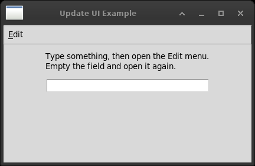

# 10. Creating and using menus

Eleven files. All eleven translate, and most of them translate to the same
sentence: it is a `tk.Menu`.



*A window whose Edit menu knows whether there is anything to edit.
EVT_UPDATE_UI has no equivalent; postcommand is called just before a
menu opens, which is the only moment the answer matters.*


| wx | Tkinter |
|---|---|
| `wx.MenuBar` | `tk.Menu`, given to a window with `config(menu=...)` |
| `wx.Menu` | `tk.Menu` |
| a sub-menu | `tk.Menu`, added with `add_cascade` |
| a pop-up menu | `tk.Menu`, shown with `tk_popup` |
| `Append` | `add_command` |
| `AppendCheckItem` | `add_checkbutton` + a `BooleanVar` |
| `AppendRadioItem` | `add_radiobutton` + a shared variable |
| `AppendSeparator` | `add_separator` |
| `Insert` | `insert_command` |
| `Enable(id, False)` | `entryconfig(label, state=DISABLED)` |
| `FindItemById` | `index(label)`, or walking the menu |
| an accelerator table | `accelerator=` **and** a separate `bind_all` |
| `EVT_UPDATE_UI` | `postcommand` on the menu |
| `wx.MenuItem` with `SetFont`, `SetBitmap` | options on the entry itself |

**There is one menu class and four uses.** The same object is a menu bar
when given to a window, a menu when cascaded from a bar, a sub-menu when
cascaded from a menu, and a pop-up when shown with `tk_popup`. wx has two
classes and Tk has one, and after a few files it stops being surprising.

## The difference that runs through the chapter: no ids

Every wx menu item has an id. `menubar.Enable(ID_SIMPLE, False)` reaches
an item from anywhere without holding the menu it is in, and
`event.GetId()` in a handler says which item called it, so one handler can
serve a dozen items.

Tkinter has no ids. An entry is addressed by its **position** in its menu,
or by its **label**, and the menu object has to be in hand:

```python
self.menu.entryconfig("Simple menu item", state=tk.DISABLED)
```

And a handler is told nothing, so an item that needs to identify itself
must be given its identity when it is made:

```python
self.menu.add_command(label=label,
                      command=lambda name=label: self.on_chosen(name))
```

`name=label` is not decoration. Without it every lambda in the loop closes
over the same variable and all three items report the last one. It is the
commonest mistake in Tkinter menu code and it produces a menu that works
and lies.

Neither arrangement wins. An id survives a label being changed or
translated and a position does not. A label is readable where an id is a
number somebody has to keep in a table. The lambda says in one line which
item does what, where wx says it in two places and a constant.

## The trap: an accelerator is a label

```python
menu.add_command(label="Accelerated", accelerator="Ctrl-A",
                 command=self.on_accelerated)
```

That draws `Ctrl-A` down the right-hand side of the menu. Pressing Ctrl-A
does **nothing**. The option is a label and only a label; the key has to be
bound separately:

```python
self.bind_all("<Control-a>", lambda event: self.on_accelerated())
```

This is the same shape as `default=tk.ACTIVE` in chapter 7 - Tk draws the
appearance and leaves the behaviour to you - and it is worse here, because
the menu is now making a promise that another line has to keep. The day
one is changed and the other is not, the menu lies to the person using it.

wx has an accelerator table: key, modifier and menu id, handed to the
frame. More ceremony, and it cannot fall out of step, because the id in
the table is the item.

`with_accelerator.py` answers it by writing both in one call, which is the
least one can do:

```python
def set_item(self, menu, label, shown, sequence, handler):
    menu.add_command(label=label, accelerator=shown, command=handler)
    if sequence:
        self.bind_all(sequence, lambda event: handler())
```

`bind_all` and not `bind`: a binding on the window alone is not reached
once a widget has the keyboard focus, and a shortcut that stops working
when the cursor is in a field is worse than no shortcut.

## EVT_UPDATE_UI, and the thing that is nearly it

wx asks. Before a menu is shown, and at idle moments, it raises
`EVT_UPDATE_UI` for each item, and the handler says whether that item
should be enabled, ticked or renamed. The program never has to remember to
keep the menu right, because it is asked - which matters in a program with
thirty menu items and a dozen places that change what they act on.

Tkinter has no such event. It has `postcommand`, a function the menu calls
just before it opens:

```python
self.menu = tk.Menu(mnu_bar, tearoff=0, postcommand=self.on_update_ui)
```

One call for the whole menu rather than one per item, and only when the
menu is opened rather than continually. That is enough for menus - nobody
can choose an item on a menu that is not open - and it is not enough for
anything else. A toolbar button that should grey out has no `postcommand`,
and in Tkinter something has to remember to grey it out when the state
changes.

That is the real difference: wx's arrangement is *pull* and Tk's is
*push*, everywhere except menus.

## Small things worth knowing

**`tearoff=0`, everywhere, including the menu bar.** Without it Tk puts a
dashed line at the top of every menu which, clicked, tears the menu off
into a window of its own. It is a Motif habit from 1990, nobody expects
it, and a person who does it by accident cannot always work out what has
happened.

It has a second cost that is easier to miss, and a test in this chapter
found it. **The tear-off line is an entry**, at position 0, and Tk
addresses entries by position. So a menu built without `tearoff=0` has
everything one position further along than it looks, and that includes a
menu bar - where the line is not even drawn, and where the first cascade
is therefore at position 1 and not 0. Every menu in this book now says
`tearoff=0`, bars included, so that a position means what it appears to
mean.

**`underline` is a position, not an ampersand.** wx writes `"E&xit"` and Tk
writes `label="Exit", underline=1`. The Tk way survives translation: a
label that becomes `"Esci"` does not silently move the underline to a
different letter.

**A pop-up needs tidying up afterwards.**

```python
try:
    self.popup.tk_popup(event.x_root, event.y_root)
finally:
    self.popup.grab_release()
```

Without the release the menu keeps the pointer grabbed on some window
managers and the rest of the desktop stops answering. In a `finally`,
because an exception in the line above would leave the grab behind for
good. And `x_root`, `y_root` and not `x`, `y`: `tk_popup` wants a place on
the screen.

**Fancy items are ordinary options.** wx builds a `wx.MenuItem`, gives it
`SetFont` and `SetBitmap`, appends it - and the book says it works on
Windows and is ignored elsewhere. A Tk entry takes `font`, `foreground`,
`image` and `compound` like any other widget, on every platform.

**Check and radio items keep their state in a variable you hold.** The
same shape as chapter 7, and chapter 1, and chapter 5. And the same saving
as chapter 6: wx radio items are a group because they are next to each
other in the menu; Tk radio items are a group because they share a
variable, so a menu item, a toolbar button and a panel button can all be
the same choice and cannot disagree.
