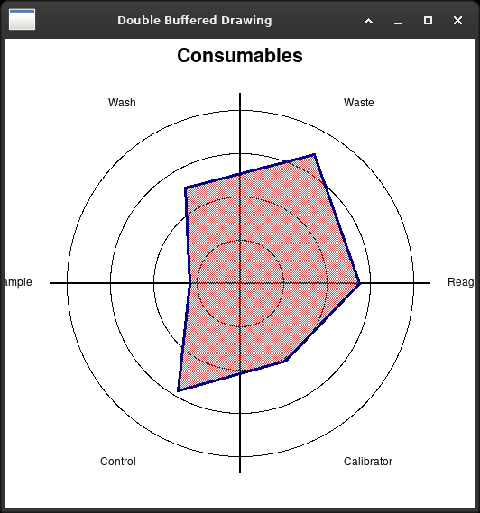

# 12. Manipulating basic graphical images

Three files. The chapter is about images and about drawing, and the two
halves come out very differently.



*The radar chart. Every circle, line, label and polygon is a canvas
item carrying its own outline and fill - there is no current pen and
no current brush to set and set back.*


## What Tkinter will read

The wx original loads the same picture four times, as `.bmp`, `.gif`,
`.jpg` and `.png`, because `wx.Image` reads all four and a good many more.

A `PhotoImage` reads **GIF, PNG, PGM and PPM**, and PNG only since Tk 8.6.
No BMP. No JPEG. No TIFF. Chapter 1 met this already, and here it is the
subject.

The answer is Pillow, as it was in chapter 1, and it is worth saying
plainly what that costs and what it does not. It costs a dependency, which
on a machine one does not administer is not nothing. It does not cost
much else: `ImageTk.PhotoImage` hands Tk an image it can draw, and from
there everything works as before.

`images.py` here draws its picture rather than shipping one, and writes it
out in the formats Tk can **write**, which is the same short list. That is
not a dodge - it is the honest demonstration, because the file cannot show
Tkinter loading a JPEG.

## Scaling is by whole numbers

`wx.Image.Scale(w, h)` scales to any size at all.

A `PhotoImage` has `subsample(n)` and `zoom(n)`, and both take whole
numbers:

```python
half = full.subsample(2, 2)      # exactly half
third = full.subsample(3, 3)     # exactly a third
```

There is no two thirds, no 1.4, and no smooth scaling - `subsample` throws
pixels away and `zoom` repeats them, which at close range looks like it
sounds. Anything better wants Pillow.

For a laboratory program this matters more than it looks. A picture of a
gel or a plate that has to fit a panel of a given size cannot be fitted
with `subsample`. Either the panel takes the size the picture happens to
be, or Pillow is on the machine.

## Pens and brushes are modes; canvas items are not

This is the difference worth taking away from the chapter, and it is the
same shape as chapter 6.

A wx device context has a **current pen** and a **current brush**. You set
one, draw, set another, draw again, and everything between the two setting
calls comes out the same:

```python
dc.SetPen(wx.Pen("black", 1))
dc.DrawCircle(...)          # thin
dc.SetPen(wx.Pen("black", 2))
dc.DrawLine(...)            # thick
```

It is a state machine, and it is efficient - four circles in the same pen
means the pen is set once - and it has the cost every state machine has.
A drawing routine that sets a pen and does not set it back changes what
the *next* routine draws, and the bug appears somewhere else.

A canvas has no modes. Every item carries its own appearance, given when
it is made:

```python
self.create_oval(..., outline="black", width=1)
self.create_line(..., fill="black", width=2)
self.create_polygon(points, fill=colour, outline="navy", width=3)
```

More words per call, nothing left behind, and nothing to set back. And
because each item is an object with a name, its colour can be changed
afterwards - `itemconfig` - which a drawn circle in wx cannot be, because
it is no longer there.

One small Tk pleasure: `stipple="gray50"` fills a shape with a fifty per
cent dither, which is how one gets a translucent-looking fill without
alpha. It is a 1990 answer and it still looks right on a chart.

## Text has to be measured differently

wx asks the device context: `dc.GetTextExtent(text)` gives the width and
height, and the text is then placed by hand.

Tkinter has two ways, and the second is the one to use. `font.Font(...)`
has `measure()` and `metrics("linespace")`, which is the direct
equivalent. But a canvas text item also has an **anchor**, so most of the
time the measuring is not needed at all - the position is said rather than
calculated:

```python
self.create_text(x, y, text=label, anchor=tk.W)
```

`radargraph.py` uses the anchor for the labels round the rim, choosing `W`
or `E` depending on which side of the circle they fall, and uses
`metrics("linespace")` once, for the height of the title.

## And the buffering goes again

The wx original is called *Double Buffered Drawing* and keeps a bitmap,
draws into it, blits it on paint, and rebuilds it on resize. None of that
is here, for the reason chapter 6 gives at length: a canvas keeps what is
on it.

What is still needed is the `<Configure>` binding, because this drawing
depends on how much room there is. It is not redrawing after damage - Tk
does that - it is recomputing a layout that has changed.

And `delete("all")` followed by building the whole thing again is the
right answer on a canvas, not a lazy one. Working out which items changed
costs more than making them afresh, until there are thousands of them.

## The files

| file | notes |
|---|---|
| `images.py` | draws its own picture; Tk reads GIF, PNG, PGM, PPM |
| `draw_image.py` | fifty canvas items, with per-pixel transparency |
| `radargraph.py` | pens and brushes against per-item options |

None of them uses the book's own artwork. `draw_image.py` sets its
transparency with `transparency_set(x, y, True)`, one pixel at a time,
which is what the `True` at the end of the wx `DrawBitmap` call asks for.
