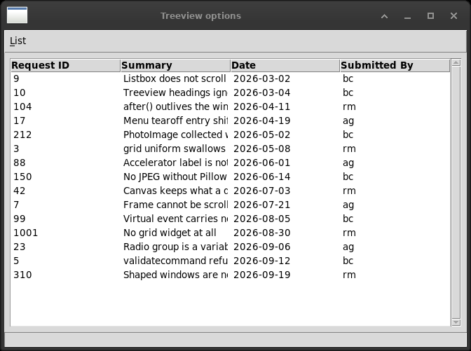

# 13. Building list controls and managing items

A `wx.ListCtrl` has four modes. This chapter translates one of them.



*Report mode, with the menu that turns the headings off, switches
between one selection and many, and stripes the rows. The stripes are
a tag, which is what a Treeview has instead of rules.*


| wx | Tkinter |
|---|---|
| `LC_REPORT` — rows and columns | `ttk.Treeview` |
| `LC_ICON` — large icons on a grid | — |
| `LC_SMALL_ICON` — small icons | — |
| `LC_LIST` — columns of names, no headings | — |
| `LC_VIRTUAL` — rows fetched as they are shown | — |
| `ColumnSorterMixin` | eight lines, written out |
| `LC_HRULES`, `LC_VRULES` | — a tag and a background colour |
| `EVT_LIST_ITEM_SELECTED` / `DESELECTED` | one `<<TreeviewSelect>>` for both |
| `EVT_LIST_ITEM_ACTIVATED` | — a `<Double-Button-1>` binding |

The four modes are one widget in wx and different widgets in Tkinter. Icon
mode is a `Canvas` with images on it, or nothing; list mode is a `Listbox`;
and report mode is a `Treeview`.

**Virtual mode has no answer at all.** `LC_VIRTUAL` asks the program for a
row when it is about to be shown, so a list of a million rows costs a
screenful of memory. A `Treeview` holds every row it is given. For a table
of results this is the limit that will be met first: a hundred thousand
rows is a hundred thousand items, and inserting them takes long enough to
notice. What one does instead is fetch a page at a time from the database
and re-fill the widget when the scrollbar moves, which is the same idea
done by hand and is not the same thing.

## The Treeview is not a table

It shows rows and columns and it is a tree that has been told not to look
like one. Two consequences.

**`show="headings"`.** A `Treeview` keeps a first column for the tree
itself - the expanders and the indentation - and it is there whether or
not anything is in it. Without `show="headings"` every row starts with an
empty space, and that is the commonest thing wrong with a Tkinter table.

**There are no cells.** `insert(values=row)` takes the whole row at once;
there is no cell to address, no cell cursor, and nothing to type into. A
`wx.ListCtrl` in report mode is read-only too, so nothing is lost here -
but this is the same wall chapter 5 met, and chapter 14 of the book is on
the other side of it.

## Sorting, and the bug it exists to avoid

wx has `ColumnSorterMixin`. It wants the data in a dictionary keyed by
item, a `GetListCtrl` method, and a pair of arrow bitmaps, and in exchange
it sorts when a heading is clicked.

Tkinter has no mixin and nothing to inherit. A heading takes a command,
and the sorting is eight lines:

```python
items = sorted(self.trv_rows.get_children(""),
               key=self.get_key(column), reverse=self.reverse)

for position, item in enumerate(items):
    self.trv_rows.move(item, "", position)
```

`move()` with an index reorders in place: nothing is deleted, nothing is
inserted, and the selection survives.

The line that matters is in `get_key`. **Everything in a Treeview is
text.** A column of numbers sorted as text puts 10 before 9 and 1001
before 42, and the list *looks* sorted, which is what makes it expensive -
nobody checks a sorted list. Measured, on the rows in `data.py`:

    as numbers   3, 5, 7, 9, 10
    as text      10, 3, 5, 7, 9

So the columns that hold numbers are named, and their values are read as
numbers before they are compared. In a laboratory list this is a result
column, and a result column that sorts wrongly is not a cosmetic bug.

## Rules, and what a tag is

`LC_HRULES` and `LC_VRULES` draw lines between the rows and the columns. A
`Treeview` has neither and cannot be given them.

What it has is **tags**, which are better for the thing people actually
want. A tag is a name given to rows; its appearance is configured once,
and every row that carries it changes at once:

```python
self.trv_rows.tag_configure("odd", background="#f0f0f0")
self.trv_rows.insert("", tk.END, values=row, tags=("odd",))
```

Striping every other row is what rules were for, and this does it better -
and the same mechanism marks a row red because its control failed, which
rules never could.

## One event where wx has three

wx raises `EVT_LIST_ITEM_SELECTED` and `EVT_LIST_ITEM_DESELECTED`
separately and tells each one which item it was about.

Tk raises `<<TreeviewSelect>>` once, for the new state, and tells you
nothing. The widget is asked what is selected *now*; what was selected
before is yours to remember if you need it. For most programs that is
simpler - the question is usually *what is selected* and not *what just
changed*.

There is no activation event. A double click is a binding, and `<Return>`
has to be bound as well if the keyboard is to get through the list, which
it should.

## The rows

The data in `data.py` has the same shape as the original - an identifier, a
summary, a date and a name - and different rows, for the reason the front
matter of this book gives: nothing of the authors' is reproduced here. A
list control showing fifteen rows demonstrates what it demonstrates
whatever the rows say.

## The files

| file | state |
|---|---|
| `data.py` | rows of our own, in the book's shape |
| `list_report.py` | translated |
| `list_report_colsort.py` | translated, and the numeric sort with it |
| `list_report_etc.py` | translated |
| `list_icon.py` | no: icon mode |
| `list_smicon.py` | no: small icon mode |
| `list_list.py` | no: list mode |
| `list_report_virtual.py` | no: virtual mode, and nothing to build it from |
