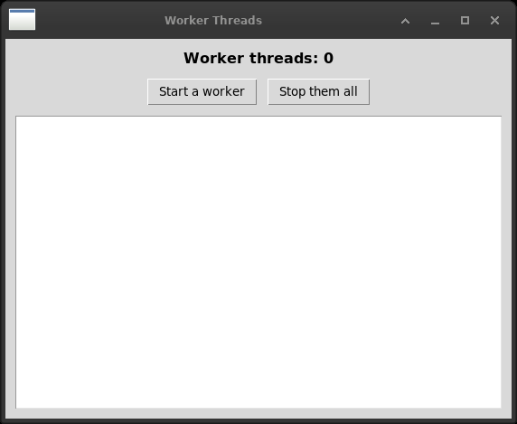

# 18. Using other functionality

The book's last chapter is a collection of things that did not fit
anywhere else. Three of them are in this one.



*Three workers reporting through a queue. Nothing in a worker thread
touches a widget: the window drains the queue with `after()`.*


| wx | Tkinter |
|---|---|
| `wx.TheClipboard` + `wx.TextDataObject` | `clipboard_clear`, `clipboard_append`, `clipboard_get` |
| `wx.Timer` + `EVT_TIMER` | `after()` and `after_cancel()` |
| `wx.CallAfter` | — a `queue.Queue` read by `after()` |
| drag and drop | — nothing in the standard library |
| `wx.Sound` | — `bell()`, and that is all |
| XRC, resources in XML | — nothing |

## The clipboard, and where it goes when you close the program

wx opens the clipboard, puts a data object in it and closes it again, and
the closing matters: a clipboard left open is a clipboard nobody else can
use.

Tkinter has three methods on any widget and no opening at all:

```python
self.clipboard_clear()
self.clipboard_append(text)
```

`clear` before `append`, because `append` adds to what is there and a
second copy without the clear would hand over both.

Two things are worth knowing, and the second is the surprise.

**`clipboard_get()` raises.** When the clipboard is empty, or holds
something that is not text - a picture copied from a browser - it raises
`TclError`. It does not return an empty string. A Paste button that does
not catch this is a traceback waiting for a Tuesday.

**On X11 the clipboard belongs to the program that filled it.** Measured
here: a program copies some text and exits; a second program started
afterwards finds the clipboard *empty*.

    CLIPBOARD selection doesn't exist or form "STRING" not defined

This is X11 and not Tkinter - the clipboard is not a place, it is a
promise by a running program to hand something over when asked, and a
program that has exited cannot keep it. Desktops usually run a clipboard
manager that takes a copy and hides the problem; this machine does not.

For a laboratory program it means: **a program must not be the only holder
of something somebody needs.** Copy a result to the clipboard by all
means, and do not expect it to still be there after the program has been
closed.

## Timers

`wx.Timer` is an object. It is made, bound to `EVT_TIMER`, started with an
interval, and it keeps going until it is stopped.

`after()` is not an object and does not keep going. It runs something
once, after so many milliseconds, and returns a name it can be cancelled
by. To repeat, the handler asks for the next one:

```python
def on_tick(self):
    self.lbl_time.config(text=time.strftime("%H:%M:%S"))
    self.tick = self.after(MILLISECONDS, self.on_tick)
```

Which makes the repetition visible in the code, and makes it possible to
forget. Three chapters of this book have now met the other half of it:
`after_cancel` must be called, or a pending callback fires at a window
that is not there and Tk complains from inside its own event loop.

And the re-arming goes at the **end** of the handler, not the beginning. A
handler that asks for the next tick and then raises leaves a timer running
against a window in a state nobody planned.

## Threads, and the rule that is not negotiable

**Only the thread that made the widgets may touch them.** This is true in
both toolkits and it is worse to break in Tkinter, because it does not
raise. A worker thread that calls `insert()` on a `Text` corrupts the
interpreter's state, and the program falls over later, somewhere else, in
a way that cannot be read backwards.

wx has `wx.CallAfter(function, *args)`: the worker hands a function to the
main thread, which calls it when it next gets the chance.

Tkinter has nothing of the sort, and the idiom everybody uses instead is a
queue:

```python
# in the worker
self.messages.put(("log", "Thread {} step {}".format(number, step)))

# in the window
def on_poll(self):
    while True:
        try:
            kind, payload = self.messages.get_nowait()
        except queue.Empty:
            break
        ...
    self.tick = self.after(MILLISECONDS, self.on_poll)
```

It is `wx.CallAfter` turned inside out. There the worker says *run this on
the main thread*; here the worker leaves a message and the main thread
comes to fetch it, and the window remains the only thing that ever touches
a widget.

The queue version is more code and it is better in one way that matters:
the messages are **data**, not calls. They can be counted, logged,
dropped when there are too many, or handled in a different order - and a
worker that is finishing can say so without knowing anything about what
the window will do about it.

`worker_threads.py` also shows the other half of working with threads,
which is stopping them. A thread cannot be stopped from outside in Python
and should not be: it might be halfway through writing a file. It is
**asked** - a flag it looks at between one step and the next - and the
window waits for it to notice.

For an instrument that answers slowly, this is the whole pattern: the
reading happens on a worker, the messages come back through a queue, and
the window stays alive and can be cancelled. The alternative, seen in
chapter 9, is to cut the work into pieces and do it in `after()` - which
is simpler and only works when the work can be cut.

## What is not here

**Drag and drop.** wx has `wx.DropSource`, `wx.DropTarget`,
`wx.FileDropTarget` and a data object protocol underneath them. Tkinter
has nothing - not between two of its own widgets, and not with the rest of
the desktop. Dragging *inside* one canvas is a `<B1-Motion>` binding and
is easy; dragging a file onto a window from a file manager needs an
external package.

**Sound.** `wx.Sound` plays a WAV file. Tkinter has `bell()`, which rings
the terminal bell, and nothing else. On Windows the standard library has
`winsound`; on Linux one runs a player.

**XRC.** wxPython can build a window from a description in XML, which is
what a graphical designer writes out. Tkinter has no resource format and
no designer. Chapter 5's argument - describe the window as data and walk
the description - is what one does instead, and it is Python rather than
XML.

## The files

| file | state |
|---|---|
| `clipboard.py` | translated |
| `timer.py` | translated |
| `worker_threads.py` | translated, with a queue in place of CallAfter |
| `drop_source.py` | no: drag and drop |
| `drop_target.py` | no |
| `customcomposite.py` | no: a custom data object for dragging |
| `sound.py` | no: `bell()` is not a translation |
| `xrcsample.py` | no: no resource format |
