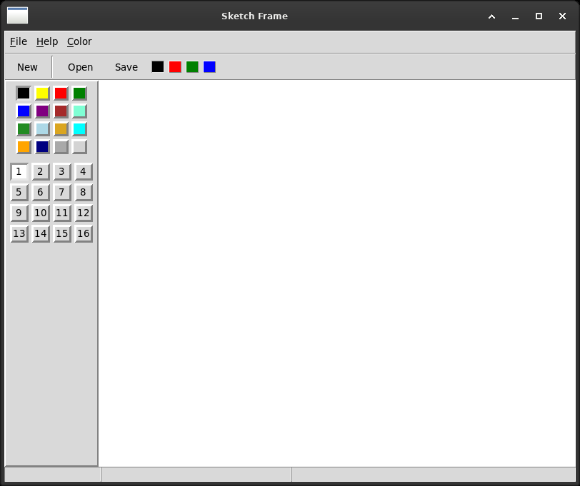

# Tkinter in Action

The source code of *wxPython in Action* rewritten in Tkinter, chapter by
chapter and file by file — and a record of what came across, what needed
three options where there was one, and what did not arrive at all.



## What this is

Thirteen chapters of examples, translated one to one: every file here
keeps the name of the file it translates, so the two can be read side by
side.

It is not a comparison and neither toolkit wins. Where they differ, the
difference is measured and written down, and that is all it is.

## Measured, not remembered

wxPython 4.2 still runs the book's code, twenty years on. So nothing here
is translated from the printed page: **each example is executed beside its
original and the two windows are compared by their geometry** — window
size, and the position and size of every widget in them.

`Chapter-11/basicgridsizer.py` returns a window of 310x85 with its
children at (0,0), (105,0), (210,0) and so on, and `wx.GridSizer` returns
the same numbers.

Matching numbers are not the point. Rounding differs, themes differ, fonts
differ. The numbers are for noticing when something differs by **more**
than that — because then there is a mechanism underneath, and that is the
interesting part. Three times in this project a claim that seemed obvious
turned out to be wrong when measured, and the chapters say so.

## The chapters

| | chapter | files | notes |
|---|---|---|---|
| 1 | Welcome | 5/5 | no JPEG without Pillow; the image must be kept alive |
| 2 | A solid foundation | 5/5 | the output window, the choice dialog and the toolbar all built |
| 3 | Events | 4/4 | virtual events; `event.data` does not exist |
| 4 | Looking at a running program | 4/4 | a shell in fifty lines, on `code.InteractiveConsole` |
| 5 | Your blueprint | 7/11 | `StringVar` is the observer Tkinter already had |
| 6 | The building blocks | 7/7 | a canvas keeps what a device context forgets |
| 7 | The basic controls | 15/15 | `wx.lib.buttons` has nothing to translate to |
| 8 | Putting widgets in frames | 10/10 | no MDI, no shaped windows, no scrollable frame |
| 9 | Dialogs | 15/15 | Tk has a font chooser Python does not offer |
| 10 | Menus | 11/11 | an accelerator is a label, not a binding |
| 11 | Sizers | 12/12 | `uniform` cannot hold an exact gap |
| 12 | Images and drawing | 3/3 | scaling is by whole numbers |
| 13 | List controls | 4/8 | everything is text, and text sorts 10 before 9 |
| 15 | Tree controls | 6/6 | a virtual tree is easy where a virtual list was impossible |
| 18 | Other functionality | 3/8 | a queue in place of `wx.CallAfter` |

Chapters 14, 16 and 17 — the grid control, HTML and printing — have no
Tkinter equivalent at all and are not attempted. Each chapter's
`README.md` says what was left out and why.

## Running it

Every file is a program and runs on its own:

```
python3 Chapter-06/example7.py
python3 Chapter-11/realworld.py
```

The tests need a display and nothing else:

```
python3 -m unittest discover -s tests -v
```

110 of them. They are not a formality: they found a silent module clash
across chapters, a repeating `after()` that outlived its window, and a
menu index that was off by one because of a tear-off line.

## Tools

| | |
|---|---|
| `tools/side_by_side.py` | opens an example and its wx original next to each other |
| `tools/record_wx_geometry.py` | records what the originals measure, as the tests' reference |
| `tools/capture.py` | takes the pictures used as figures |

Each chapter's `README.md` is written to be read straight through as well
as beside the code.

`side_by_side.py` needs wxPython and the book's own sources, which are not
part of this repository.

## What does not translate

Worth knowing before choosing a toolkit, and collected here from the
chapters that found it:

- **No grid control.** No widget displays a rectangular array of editable
  cells. A `Treeview` shows rows and columns and nothing in it can be
  typed into.
- **No MDI**, and no way to put one window inside another.
- **No scrollable frame.** A `Scrollbar` talks to a `Listbox`, a `Text`, a
  `Canvas`, a `Treeview` and an `Entry`. A `Frame` is not one of them.
- **No HTML widget**, and therefore no chapter 16.
- **No printing**, and therefore no chapter 17.
- **No shaped windows** on X11, and no context help button anywhere.
- **No drag and drop** in the standard library.
- **No JPEG, no BMP**, without Pillow.

And the other way round, things Tkinter has that wxPython does not: an
observable value in `StringVar`, text tags on every platform where wx asks
its platform nicely, `validatecommand` that refuses an edit before it
happens, and `invoke()`, which makes every button in this repository
testable in one line.

## Source and attribution

Rappin, Noel and Robin Dunn, *wxPython in Action*, Manning Publications,
2006.

The example code that accompanies the book is its authors'. **Nothing of
theirs is reproduced here** — not the code, not the sample data, not the
artwork. Where an example needs rows in a table or a picture on a button,
this repository has its own: the data has the same shape and different
contents, and the pictures are drawn in the source. The rows and the
pictures were never the lesson.

What is faithful in a translation is the code — the same calls, the same
structure, the same file names, the same behaviour — and that is followed
as closely as two different toolkits allow.

## Conventions

`CONVENTIONS.md`. Read it before adding a file.

## Licence

MIT, see `LICENSE`.

---

*autumnus MMXXVI*
